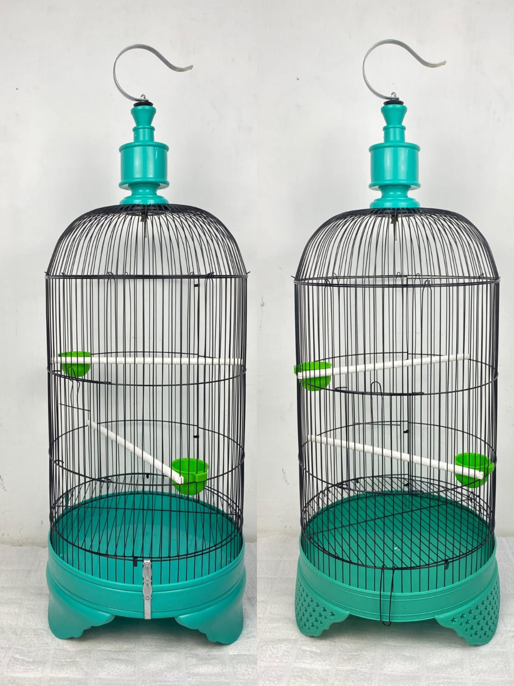

# Product Edit Guide — Gallery Sangkar Indonesia

Website ini masih static, tidak memakai backend. Semua produk dapat diedit langsung dari file `index.html`.

## 1. Mengubah nama produk
Buka `index.html`, lalu cari:

```html
<section id="produk">
```

Di dalam setiap card produk, ubah bagian:

```html
<h3 class="card-title text-2xl mb-4">Sangkar Besi Berwarna</h3>
```

## 2. Mengubah harga produk
Masih di card produk yang sama, ubah bagian:

```html
<h2 class="text-primary text-3xl font-bold mb-6">Rp.299.000</h2>
```

## 3. Mengubah foto produk utama
Ubah `src` pada gambar di dalam `<figure>`:

```html

```

Simpan file gambar baru di folder:

```text
assets/images/
```

## 4. Mengubah opsi warna
Opsi warna ada di bagian:

```html
<h2 class="card-title mb-6">Pilihan Warna</h2>
```

Setiap opsi warna memakai class, contoh:

```html
<li class="sangkar-besi-merah">
```

Class tersebut otomatis mengambil gambar:

```text
assets/images/sangkar-besi-merah.jpg
```

Jadi nama class dan nama file gambar harus sama.

## 5. Mengubah nomor WhatsApp
Cari tombol:

```html
https://wa.me/6282142853691
```

Ganti nomor dengan format internasional tanpa `+`, tanpa spasi, dan tanpa angka `0` di depan.

Contoh:

```text
081234567890 -> 6281234567890
```

## 6. Menambah produk baru
Copy satu block card produk dari:

```html
<div class="card bg-base-100 shadow-xl group flex-col lg:flex-row" id="...">
```

sampai penutup `</div>` card tersebut, lalu paste di dalam grid produk.

Setelah itu ubah:
- `id`
- gambar utama
- nama produk
- harga
- link WhatsApp jika perlu

JavaScript sudah dibuat otomatis membaca semua card di dalam `#produk`, jadi tidak perlu menambah kode JS lagi.


---

## Catatan Revisi Layout
- Hero dan About memakai style yang terinspirasi dari layout Healet: teks kiri, image/background kuat, white space lebih rapi, dan CTA sederhana.
- Product card tidak diubah pada revisi ini.
- Jarak card social media di section Temukan Kami ditambah melalui CSS di `assets/css/output.css`.
